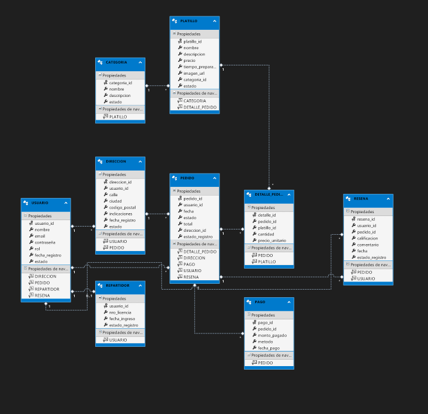

## Descripción del negocio

**Pizzería Hot** es un establecimiento dedicado a la preparación y venta de pizzas artesanales, atendiendo tanto a clientes que se acercan al local como a pedidos para envío a domicilio.  
Nuestro sistema de escritorio permite:

- **Registrar y gestionar clientes**: almacenar datos de contacto y direcciones para entregas.  
- **Administrar el catálogo de platillos** (pizzas, bebidas y complementos) con sus precios y disponibilidad.  
- **Procesar pedidos**: crear la orden seleccionando productos y cantidades, calcular subtotales y totales, y registrar el estado (pendiente, en preparación, entregado).  
- **Llevar el control de stock** de ingredientes esenciales para la elaboración de cada receta.  
- **Gestionar usuarios del sistema** con distintos roles (Administrador, Repartidor, Cliente), cada uno con permisos específicos.

El alcance inicial abarca desde el **login** y el **CRUD** de dos tablas principales (Usuarios y Platillos), hasta la funcionalidad completa de **Pedido y Detalle de Pedido**, incluyendo la generación de informes básicos de ventas diarias. A futuro, está contemplado integrar reportes avanzados y conexión con impresoras de cocina.

## Diagrama ER
```markdown
    ### Modelo de datos (ER)

    ```

## Casos de uso clave
Login: el usuario ingresa email y contraseña para entrar al sistema.

Crear pedido: el cliente selecciona platillos y cantidades, el sistema calcula totales y registra la orden.

Ver mis pedidos: el cliente ve el historial de pedidos con su estado (pendiente, entregado).

Administrar platillos: el administrador agrega, edita o desactiva pizzas en el catálogo.

Registrar repartidor: el administrador asigna un usuario con rol “Repartidor” y número de licencia.

## Arquitectura de Capas

  +-----------------------+
  |   LabPizzeria DB      |
  | (Tablas, Stored Procs)|
  +-----------+-----------+
              |
              v
  +-----------------------+
  |   CadPizzeria         |
  | (Entity Framework /   |
  |  Acceso a datos)      |
  +-----------+-----------+
              |
              v
  +-----------------------+
  |   ClnPizzeria         |
  | (Reglas de negocio,   |
  |  servicios, validación)|
  +-----------+-----------+
              |
              v
  +-----------------------+
  |   CpPizzeria          |
  | (WinForms, UI, validaciones) |
  +-----------------------+

Breve explicación

LabPizzeria (DB): tu base de datos SQL Server con todas las tablas y relaciones.

CadPizzeria: capa de datos, usa Entity Framework para mapear tablas a clases y exponer métodos de consulta/inserción.

ClnPizzeria: encapsula la lógica de negocio: validaciones, reglas, transacciones y orquestación entre entidades.

CpPizzeria: la interfaz de usuario WinForms donde el usuario interactúa; debe invocar a ClnPizzeria y mostrar resultados, validando campos y manejando eventos


